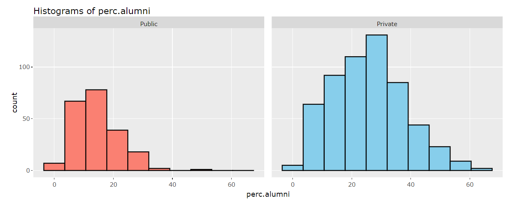
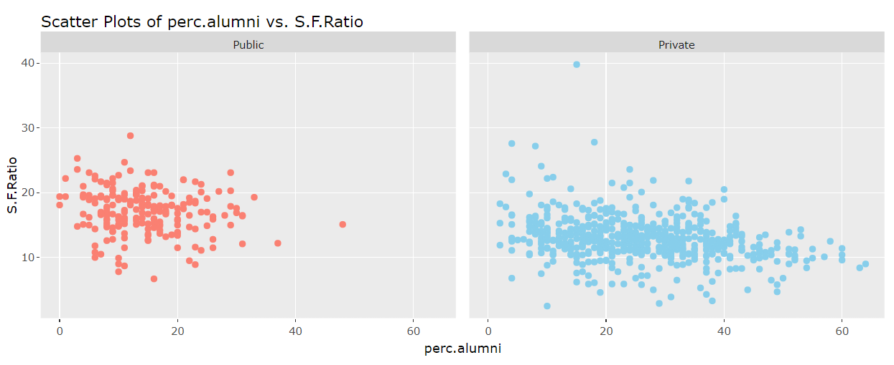
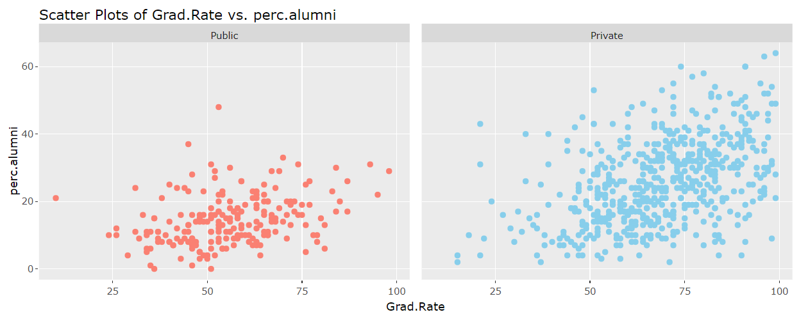
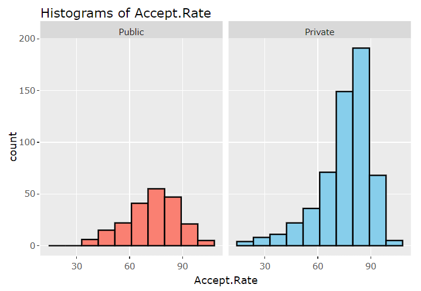
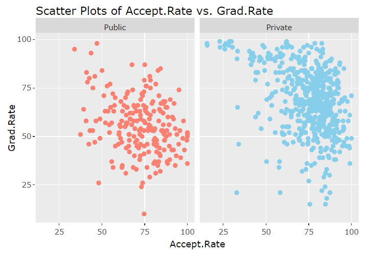
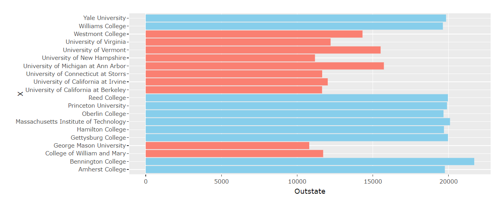
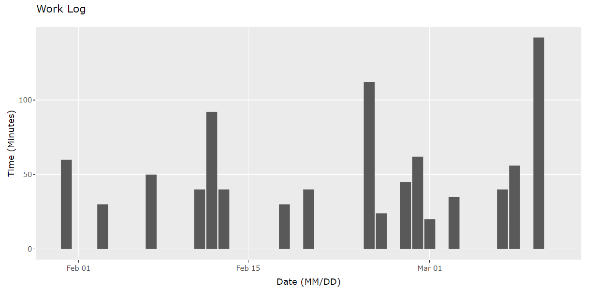

```{r setup, include=FALSE}
library(tidyr)
library(dplyr)
library(magrittr)  
library(ggplot2)   # ploting graphs library
library(cowplot)   # Graph Aesthetic

library(wordcloud) # wordcloud graph
knitr::opts_chunk$set(echo = TRUE)
```

I confirm that the above list of sources is complete AND that I have not talked to anyone else about the solution to this problem.
\newpage

# The Project
|    The goal of this project is to see differences between private and public colleges and what these differences are through quantitative data. Expected users of this app include students, parents, and school counselors looking at colleges with certain characteristics and performances. Key questions the app seeks to answer include differences in enrollment and acceptance rates between private and public colleges, correlations between variables like application count and graduation rates, through insights from visualizations including histograms, scatter plots, bar charts, and word clouds. The data set being used comes from kaggle being a data set from 2019 on 777 colleges in the US. The variables found in the data set include:

* X - College/University Name
* Private - Yes or no on whether the school is private
* Apps - Number of applications
* Accept - Number of acceptances
* Enroll - Number of new enrollments
* Top10perc - Number of new students in top 10% in HS
* Top25perc - Number of new students in top 25% in HS
* F.Undergrad - Number of fulltime students
* P.Undergrad - Number of parttime students
* OutState - Out of state tuition
* Room.Board - Room and board cost
* Books - Estimated book costs
* Personal - Estimated personal spending
* PHD - Percentage of faculty with PHDs
* Terminal - Percentage of faculty with Terminal degrees
* S.F.Ratio - Student to faculty ratio
* perc.alumni - Percentage of alumni who donate
* Expend - Instructional expenditure per student
* Grad.Rate - Graduation rate

With the addition of: 

* Accept.Rate - the acceptance rate of a college
* Enroll.Rate - the enrollment rate of a college

\newpage

# College Modified Info Table with Tibble
|    Below is the college data set with selected variables to reduce the size of the table. This table includes the two additions calculated through Accept/Apps and Enroll/Accept to create Accept.Rate and Enroll.Rate respectively.
```{r}
unisMod <- read.csv("../College_Data.csv")  %>%
  mutate(Enroll.Rate = (Enroll / Accept)*100) %>% 
  mutate(Accept.Rate = (Accept / Apps)*100) %>% 
  select(X, Private, Apps, Accept.Rate,Enroll, Enroll.Rate, Grad.Rate)
as_tibble(unisMod)
```

\newpage

# College Data Overview
|    Looking through visualizations there were some that stood out showing clear differences between public and private colleges. Through displaying the data it is clear to see that within the histogram below private colleges tend to have more alumni donate back to their college having the peak frequency centered at 28%, while public colleges have a peak frequency at 14%. It interesting to see that private colleges have a higher percentage of alumni contribute and give back to their schooling. There are many different reasons this could be the case, but through visualization we can see a possible correlation.

{height=400px} 
# Alum Donation vs Student-Faculty Ratio Observations
|    With this scatter plot displaying the percentage of alumni donating to the college versus student to faculty ratio there is a clear implied line found as the percentage increases the ratio of students to faculty tends to decrease. As such there is an inverse correlation between the two. Commonly when the amount of faculty is closer to the student count the amount of alumni donating should also increase.

{height=400px}

# Grad Rate vs Alum Donation Observations
|    Similarly we can see when comparing the graduation rates of colleges vs the percentage of alumni donating to each school, public colleges tended to have a more horizontal correlation. Private colleges tend to have a positive trend where the higher the graduation rate is the higher the percentage of alumni can be. It is interesting to notice that very few colleges fall to the left of this line and alumni don't tend to give donations to private colleges with lower graduation rates.

{height=400px}

# Acceptance Rate Observations
|    Looking at acceptance rates of colleges private colleges have a peak with an acceptance rate of 84% while public colleges have a peak at 75% found in the histogram above. This correlation tied with the graduation rates of colleges displays that private colleges with higher acceptance rates have a large array of graduation rates, but private colleges with lower acceptance rates tend to have higher graduation rates.
{width=50%}{width=50%}

# Bar Chart Out of State Tuition Observations
The bar chart finds the top 10 colleges within both private and public colleges and with this the highest values of each variable can be found to easily be compared. Looking at the out of state tuition it is clear that all public colleges cost less than the most expensive private college in the data set. With that all the top 10 most expensive private colleges all are more expensive than any of the top public colleges/universities. The bar chart in this case gives a very small amount of observations displayed.

{height=400px}
# Word Cloud Applications Display
|    Finally with the word cloud there are two sliders that can limit the colleges found within the wordcloud. There are limitations with the word cloud when it comes to variability in frequency when there is smaller variability in frequency the amount of colleges that can fit within the frame decreases drastically to only include 4 or 5 schools. This along with the difference in counts of private and public colleges in the data set displaying each as public or private shows the discrepancy in data observations of public colleges/universities. Though the wordcloud is a new insteresting way to view a certain variable.

{height=400px}

# Process

|    The data set with no null values or unnecessary or unorganized variables needed little organization before moving to visualization. The only additions were mutations to create acceptance and enrollment rates of each college/university. Making the shiny app first was the division of the project overview along with interesting graphs found within the app along with the visualization itself through tabPanel. Then through selectInput the 4 types of visualizations can be chosen. With sliders and buttons each visualization is made to be more interactive. Finally, to easily tidy up the app itself a shinytheme is used to quickly stylize buttons and text.

## What

|    The data set being looked at is of 777 US colleges from 2019 and variables of each. The data is found on kaggle and the visualizations used are the histogram, bar chart, scatter plot, and word cloud. 

## Why

|    The data seen is useful for prospective students looking for schools to go to after high school similarly it is helpful for school counselors who look many different colleges in order to help students find their desired school. The histogram and bar chart help see differences between private and public colleges. The scatter plot can be used to not only see correlations between private and public colleges, but it also can be used to find single colleges that might be within a certain range or as an outlier.

## How 

|    Through color channels we can isolate seen data to find private and public colleges more easily using sky blue and salmon respectively. This along with the use of splitting visualizations to display the two separately side by side allows for users to clearly see differences within the data. The Histogram uses vertical lines while the bar chart utilizes horizontal lines to display a difference between the two as well to allow for the y axis to display the names of each school being visualized with in the chart. Finally the word cloud can use color channels, but the random nature for the color channel creates an intersting visualization appealing to the eyes.

# Possible Imrovements

|    Some improvements that could be made for the future include using updateSliderInput to display slider ranges for each variable for the word cloud. There was a conflict between outputting the word cloud and updating the slider input that couldn't be resolved so ultimately it made the overall experience more difficult to understand while using the wordcloud. I also wish the hover information was better displayed while looking at each point on the scatter plot. The data displayed is the only available info displayed which could be more helpful knowing the college as well. Another issue is legend making when using ggplotly I would've liked to fix how the legend is made and working legends stop working when switching from plotOutput to plotlyOutput, as such it would've been nice to inlcude ggplotly for the histogram.

## Appendix

{height=500px}

## References

Munzner, Tamara. Visualization Analysis & Design. Boca Raton, FL: CRC Press/Taylor & Francis Group, 2015.

Beeley, Chris. Web Application Development with R Using Shiny: Integrate the Power of R with the Simplicity of Shiny to Deliver Cutting-Edge Analytics over the Web, Second Edition. 2nd ed. Birmingham: PACKT Publishing, 2016.

Mailund, Thomas. Beginning Data Science in R 4: Data Analysis, Visualization, and Modelling for the Data Scientist. Second edition. New York, NY: Apress Media, LLC, 2022.